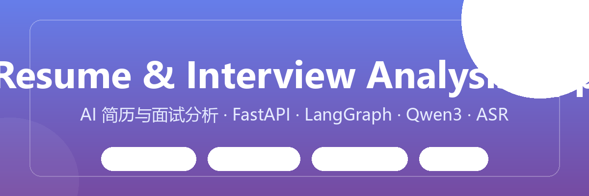
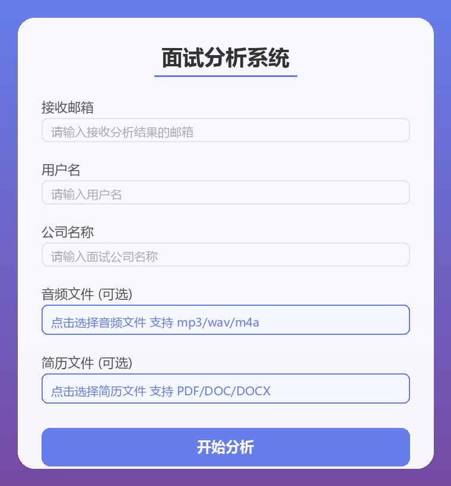

<div align="center">

# Resume & Interview Analysis App

**AI 简历与面试分析应用** — 上传简历与面试录音，AI 自动生成专业面试分析报告

**中文** | [English](README_EN.md)


</div>

<p align="center">
  
</p>

---

## 📖 项目简介

一个基于 **FastAPI + LangGraph + 阿里云 DashScope** 的求职辅助应用：
- 上传 **PDF 简历** → 自动抽取结构化信息 → 生成简历点评
- 上传 **面试录音** → ASR 语音转文字 → 基于转录内容 + 简历生成**完整面试分析报告**
- 分析完成后自动生成 **Word 报告**并发送到指定邮箱

**录音是可选的** —— 只传简历也能单独分析。

## ✨ 功能特性

| 特性 | 说明 |
|------|------|
| 📄 简历结构化解析 | pdfplumber 抽取 PDF 文本，LLM 提炼教育/经历/技能等字段 |
| 🎙 语音转文字（ASR）| ffmpeg 切片 + DashScope qwen3-asr-flash 并发转写 |
| 🧠 面试分析工作流 | LangGraph 编排 11 个节点，多路并行生成报告各段落 |
| 📧 邮件报告 | 分析完成自动发送 docx 报告（含内联图）到指定邮箱 |
| ☁️ 对象存储 | 报告与转写文本自动归档至 MinIO |
| ⚡ 缓存加速 | ASR 结果 Redis 缓存，重复音频不重复调用模型 |
| 🖥 开箱即用 | 内置 Web 前端页面 + Swagger 文档 |

## 📸 界面预览



## 🏗 架构总览

```
┌─────────────────────────────────────────────────────────────┐
│                       前端 (Web / Swagger)                    │
└──────────────────────────┬──────────────────────────────────┘
                           │ HTTP
┌──────────────────────────▼──────────────────────────────────┐
│                    API 层  (Analyzer/api/coreApi.py)            │
│        /interview/interview_analysis   /interviewaudio_2_text│
└──────────────────────────┬──────────────────────────────────┘
                           │
┌──────────────────────────▼──────────────────────────────────┐
│             业务层  WorkFlow 引擎 (LangGraph 封装)            │
│   简历抽取 → 音频处理 → 报告段落 → 评价 → 报告生成             │
│   每个节点 = 一次 LLM 调用，无依赖节点并行执行                  │
└──────┬──────────────┬──────────────┬────────────────────────┘
       │              │              │
       ▼              ▼              ▼
┌──────────┐   ┌──────────┐   ┌──────────────┐
│EmailService│  │AsrService│   │  MinIOService │
└─────┬────┘   └────┬─────┘   └──────┬───────┘
      │             │               │
┌─────▼─────────────▼───────────────▼──────────┐
│           Client 层 (统一封装/单例)             │
│   QwenLlm / AsrClient / RedisClient /          │
│   MinioClient / EmailClient                    │
└─────┬──────────────────┬──────────────────────┘
      │                  │
      ▼                  ▼
┌──────────────┐  ┌────────────────────┐
│  DashScope   │  │  Redis / MinIO /   │
│  (qwen3-max) │  │  MySQL(可选)        │
└──────────────┘  └────────────────────┘
```

**分层原则**：业务代码只与 Client 层对话，不直接触碰第三方 SDK —— 换存储、换模型、改配置都只影响各自的一层。

## 🧱 技术栈

| 分类 | 技术 |
|------|------|
| Web 框架 | FastAPI · Uvicorn · python-multipart |
| LLM | 阿里云 DashScope（qwen3-max）· OpenAI SDK |
| ASR 语音转文字 | DashScope qwen3-asr-flash |
| 工作流引擎 | LangGraph（自定义 WorkFlow 封装层）|
| 文档解析/生成 | pdfplumber（中文友好）· PyPDF2 · docxtpl · Jinja2 |
| 存储/缓存 | Redis · MinIO · MySQL（Base 框架）|
| 音频处理 | ffmpeg（static-ffmpeg）|

## 🚀 快速开始

### 环境要求
- Python 3.10+
- 阿里云百炼 API Key（[开通地址](https://bailian.console.aliyun.com/)）
- QQ 邮箱 + SMTP 授权码（发送报告）

### 1. 安装依赖

```bash
git clone https://github.com/你的用户名/ResumeInterviewAnalyzer.git
cd ResumeInterviewAnalyzer
pip install -r requirements.txt
```

### 2. 配置环境变量

```bash
cp .env.example .env
```

编辑 `.env`，**至少**填写三项：

```ini
# LLM / ASR（必填）
DASHSCOPE_API_KEY=你的_百炼_API_Key

# 邮件发送（必填）
SENDER_EMAIL=你的_QQ邮箱@qq.com
EMAIL_PASSWORD=你的_QQ邮箱_SMTP授权码

# ffmpeg 路径（必填，指向含 ffmpeg.exe/ffprobe.exe 的目录）
FFMPEG_PATH=你的_ffmpeg目录
```

> Redis / MinIO / MySQL 为可选，未配置时相关功能降级，不影响主流程。

### 3. 启动

```bash
python main.py
# 或
uvicorn Analyzer.main:app --host 0.0.0.0 --port 8000
```

### 4. 访问

| 入口 | 地址 |
|------|------|
| 前端页面 | http://127.0.0.1:8000/ |
| Swagger 文档 | http://127.0.0.1:8000/docs |

> Windows 建议 `PYTHONIOENCODING=utf-8` 运行，避免中文日志编码报错。

## 📡 API 接口

### POST `/interview/interview_analysis`
简历 / 面试分析（**录音可选**，至少传一个文件）

| 参数 | 类型 | 必填 | 说明 |
|------|------|------|------|
| `receive_email` | form | ✅ | 接收报告的邮箱 |
| `user_name` | form | ✅ | 用户名 |
| `company_name` | form | ✅ | 面试公司名 |
| `resume_file` | file | ❌ | PDF 简历 |
| `audio_file` | file | ❌ | 面试录音 |

### POST `/interviewaudio_2_text`
音频转文字

| 参数 | 类型 | 必填 | 说明 |
|------|------|------|------|
| `audio_file` | file | ✅ | 音频文件（mp3/wav/m4a 等）|

## 🔄 面试分析工作流

```
阶段1  简历抽取 + 音频处理（并行）
        └─ extract_resume      LLM 提炼简历字段
        └─ audio_handle        ffmpeg 切片 → ASR 转写 → LLM 合并

阶段2  报告内容（并行，各调 LLM）
        └─ get_report_paragraph1   报告开篇段落
        └─ get_qa_pair             面试问答对提取
        └─ resume_analysis         简历点评

阶段3  多维评价（并行）
        └─ analysis_end / self_evaluation / ai_evaluation
        └─ qa_pairs_analysis / get_report_table_data_json

阶段4  generate_report    渲染 docx → 存 MinIO → 发邮件
```

## 📂 项目结构

```
ResumeInterviewAnalyzer/
├── main.py                    # 启动入口
├── requirements.txt
├── .env.example               # 环境配置模板
├── ARCHITECTURE.md            # 架构设计文档（推荐阅读）
├── Analyzer/                     # ★ 业务包
│   ├── main.py                #   FastAPI 应用与中间件
│   ├── router/                #   路由注册
│   ├── api/coreApi.py         #   接口定义
│   ├── ai/interview/          #   面试分析工作流（节点 + 状态）
│   ├── core/                  #   核心分析逻辑
│   ├── service/               #   邮件 / ASR / MinIO 服务
│   ├── prompt/                #   LLM 提示词
│   ├── frontend/              #   前端页面
│   └── static/                #   报告模板 / 邮件图片
├── Base/                      # ★ 基础框架
│   ├── Ai/                    #   LLM 抽象与实现（Qwen）
│   ├── Client/                #   外部资源统一封装（单例）
│   ├── Config/                #   配置中心（pydantic-settings）
│   ├── Service/               #   通用服务（ASR / 邮件）
│   ├── Repository/            #   数据访问层
│   └── RicUtils/              #   通用工具（PDF/音频/Redis缓存等）
└── WorkFlow/                  # ★ 工作流引擎（LangGraph 二次封装）
```

## 💡 技术亮点与设计思考

- **单例 + 工厂**：Redis / MinIO / Milvus 客户端均为单例（元类 / `__new__` / 模块级三种实现），连接只建一次；`get_*_client()` 工厂隔离底层实现。
- **Client 层封装**：业务不直接接触第三方 SDK，所有外部资源（LLM/存储/缓存）统一收口到 Client 层，换底层库零业务改动。
- **工作流引擎二次封装**：LangGraph 之上封装 `graph_node` 装饰器 + 节点分组并行，业务以声明式方式描述流程。
- **配置中心**：pydantic-settings 按模块前缀分组读取 `.env`，类型安全、集中管理、敏感信息不入库。
- **中文文档解析**：pdfplumber 优先（中文 PDF 友好），PyPDF2 兜底，解决中文简历乱码问题。
- **工程化细节**：ASR 结果 Redis 缓存（`ex=3600`）、音频重叠切片、并发转写保持顺序、LLM 请求超时与重试。

## 🔒 安全说明

- `.env` 已被 gitignore，密钥不入库
- 上传的音频/简历仅在处理期间临时保存，处理完自动删除
- 发件人显示名、收件人邮箱均可通过配置自定义

## 📄 License

[MIT](LICENSE)
